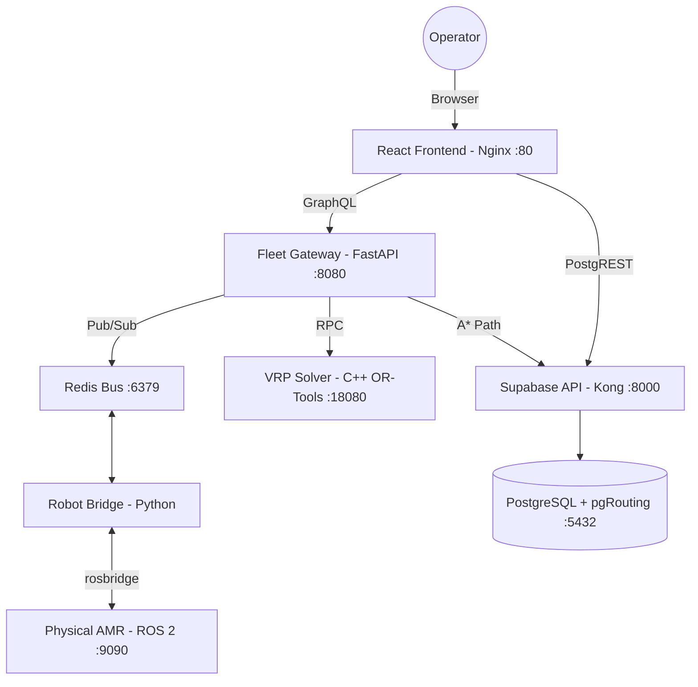

# WCS — Warehouse Control System (Lertvilai V2)

[](https://www.docker.com/)
[](https://reactjs.org/)
[](https://fastapi.tiangolo.com/)
[](./LICENSE)

**WCS (Warehouse Control System)** is a comprehensive, production-grade fleet management and orchestration platform designed for Autonomous Mobile Robots (AMR). It provides a seamless, end-to-end workflow—from interactive warehouse topology design and multi-robot route optimization (VRP) to real-time telemetry monitoring and fleet recovery—all accessible via a modern, high-performance web interface.

---

## 🏗 System Architecture

The system is built on a distributed, containerized microservices architecture to ensure scalability, fault tolerance, and ease of deployment.



### Component Breakdown
*   **Frontend (React 19 + Vite)**: A high-performance SPA using **React Flow** for graph editing and **Tailwind CSS** for styling.
*   **Fleet Gateway (FastAPI + Strawberry GQL)**: The central brain that orchestrates commands, resolves paths via A*, and manages the GraphQL API.
*   **VRP Solver (C++ OR-Tools)**: A dedicated service for solving complex Vehicle Routing Problems with time windows and capacity constraints.
*   **Robot Bridge**: A lightweight Python service acting as a translator between Redis (Internal) and ROS 2 (Robot) protocols.
*   **Supabase Stack**: Provides an instant backend with PostgreSQL, real-time subscriptions, and secure API access via Kong.

---

## 🚀 One-Click Installation & Deployment

We provide a **Turn-key Solution** that handles IP detection, security keys, and network orchestration automatically.

### 1. Prerequisites
*   **Docker Desktop** (v24.0+) or **Docker Engine** with **Compose V2**.
*   Network connectivity between the host machine and the robots (LAN).

### 2. Initialize Environment
Run the automated initialization script. This will detect your **Local IP** (e.g., `10.61.6.87`), generate secure **JWT Secrets**, and configure your `.env` file.

```bash
chmod +x env_init.sh
./env_init.sh
```
*Follow the interactive prompts to select your robot type (Simulator vs. Physical Robot).*

### 3. Launch the Stack
Start all 10+ microservices in detached mode. The system will build the Frontend and Gateway images locally to match your environment.

```bash
docker compose up -d --build
```

---

## 🌐 LAN Access & Networking

The system is optimized for **On-Site Deployment**. Once launched, the WCS is accessible to everyone on the same LAN:

| Service | LAN URL | Description |
|---|---|---|
| **WCS Web Interface** | `http://<HOST_IP>` | Primary operator dashboard (Port 80) |
| **Fleet Gateway IDE** | `http://<HOST_IP>:8080/graphql` | Interactive GraphQL Console (GraphiQL) |
| **Supabase Studio** | `http://<HOST_IP>:54323` | Direct Database Management GUI |
| **API Endpoint** | `http://<HOST_IP>:8000` | Secure REST/Realtime API via Kong |

> **Note:** If your host machine IP changes, simply re-run `./env_init.sh` and restart the containers.

---

## 🛠 Feature Reference

### 🗺 Map Designer (Tab 1)
*   **Graph Editing**: Drag-and-drop nodes (Waypoints, Shelves, Conveyors) and draw directed edges.
*   **Multi-level Shelves**: Manage complex 3D storage with automated cell alias generation (`S3C2L1`).
*   **Background Mapping**: Upload and scale warehouse floorplans (PNG/JPG) as a canvas layer.
*   **Persistence**: Batch-save entire graph topologies to the cloud-synced database.

### ⚡ Optimization & VRP (Tab 2)
*   **Task Queuing**: Create pickup-delivery requests with visual node selection.
*   **A* Pathfinding**: Real-time path expansion using in-database **pgRouting**.
*   **Fleet Optimization**: Solve multi-robot assignments using the C++ VRP engine to minimize total travel cost.
*   **Sequential Dispatch**: Reliable command delivery via Redis Pub/Sub with live execution tracking.

### 📡 Fleet Controller (Tab 3)
*   **Live Telemetry**: Real-time robot positioning and status updates (Idle/Operating/Error).
*   **Global ESTOP**: Instant emergency stop broadcasting to all active robots.
*   **Hard Reset Sequence**: A 4-step automated recovery workflow to clear robot faults and re-sync status.
*   **Color-coded Logs**: Intelligent system log categorization (Error, Warning, Success, Info).

---

## 🔒 Security & Data Management

*   **JWT Authentication**: All API requests are signed and verified using HS256 JWTs.
*   **Environment Isolation**: Secrets and database passwords are never committed; they are generated uniquely per installation.
*   **Persistent Volumes**: Database data (`db_data`) and Redis cache (`redis_data`) are stored in Docker volumes to persist across restarts.

---

## 📂 Repository Structure

```text
wcs/
├── env_init.sh             # DevOps: Auto-configures IP, JWT, and .env
├── docker-compose.yml      # Orchestration: Defines the full microservice stack
├── frontend/               # UI: React 19 + Vite + Tailwind (Production Build)
├── fleet_gateway_custom/   # Brain: Python FastAPI + GraphQL + Pathfinding
├── robot_bridge/           # Communication: Redis <-> ROS 2 Bridge
├── db_schema/              # Data: SQL migrations and pgRouting functions
└── volumes/                # Config: Kong, Postgres init, and Storage data
```

---

## 🛠 Troubleshooting

| Issue | Resolution |
|---|---|
| **Robot is "OFFLINE"** | Ensure the `ROBOT_NAME` in `.env` matches the robot's configuration exactly (Case-sensitive). Check the heartbeat in Redis. |
| **Database Connection Error** | If you changed the password after the first run, you must destroy volumes: `docker compose down -v`. |
| **Frontend blank page** | Check if `VITE_SUPABASE_URL` in `.env` matches your current machine IP. |

---

## 📜 License & Acknowledgments

**Internal Project — Lertvilai V2 / WCS Development Team.**
This software is proprietary and intended for internal use and authorized client deployments.

---
*Maintained by DevOps & WCS Team.*
